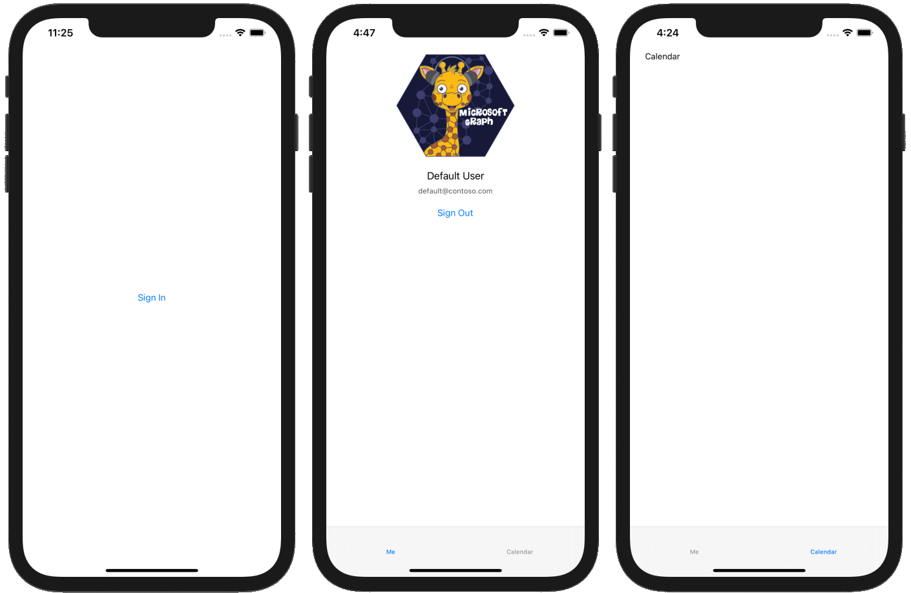

<!-- markdownlint-disable MD002 MD041 -->

<span data-ttu-id="4ebcf-101">Commencez par créer un projet SWIFT.</span><span class="sxs-lookup"><span data-stu-id="4ebcf-101">Begin by creating a new Swift project.</span></span>

1. <span data-ttu-id="4ebcf-102">Ouvrez Xcode.</span><span class="sxs-lookup"><span data-stu-id="4ebcf-102">Open Xcode.</span></span> <span data-ttu-id="4ebcf-103">Dans le menu **fichier** , sélectionnez **nouveau**, puis **projet**.</span><span class="sxs-lookup"><span data-stu-id="4ebcf-103">On the **File** menu, select **New**, then **Project**.</span></span>
1. <span data-ttu-id="4ebcf-104">Choisissez le modèle d' **application vue unique** , puis sélectionnez **suivant**.</span><span class="sxs-lookup"><span data-stu-id="4ebcf-104">Choose the **Single View App** template and select **Next**.</span></span>

    

1. <span data-ttu-id="4ebcf-106">Définissez le **nom** du produit `GraphTutorial` sur et la **langue** sur **objectif-C**.</span><span class="sxs-lookup"><span data-stu-id="4ebcf-106">Set the **Product Name** to `GraphTutorial` and the **Language** to **Objective-C**.</span></span>
1. <span data-ttu-id="4ebcf-107">Renseignez les champs restants, puis cliquez sur **suivant**.</span><span class="sxs-lookup"><span data-stu-id="4ebcf-107">Fill in the remaining fields and select **Next**.</span></span>
1. <span data-ttu-id="4ebcf-108">Choisissez un emplacement pour le projet et sélectionnez **créer**.</span><span class="sxs-lookup"><span data-stu-id="4ebcf-108">Choose a location for the project and select **Create**.</span></span>

## <a name="install-dependencies"></a><span data-ttu-id="4ebcf-109">Installer les dépendances</span><span class="sxs-lookup"><span data-stu-id="4ebcf-109">Install dependencies</span></span>

<span data-ttu-id="4ebcf-110">Avant de poursuivre, installez des dépendances supplémentaires que vous utiliserez plus tard.</span><span class="sxs-lookup"><span data-stu-id="4ebcf-110">Before moving on, install some additional dependencies that you will use later.</span></span>

- <span data-ttu-id="4ebcf-111">[Bibliothèque d’authentification Microsoft (MSAL) pour iOS](https://github.com/AzureAD/microsoft-authentication-library-for-objc) pour l’authentification auprès d’Azure ad.</span><span class="sxs-lookup"><span data-stu-id="4ebcf-111">[Microsoft Authentication Library (MSAL) for iOS](https://github.com/AzureAD/microsoft-authentication-library-for-objc) for authenticating to with Azure AD.</span></span>
- <span data-ttu-id="4ebcf-112">[Kit de développement logiciel (SDK) Microsoft Graph pour objective C](https://github.com/microsoftgraph/msgraph-sdk-objc) pour les appels à Microsoft Graph.</span><span class="sxs-lookup"><span data-stu-id="4ebcf-112">[Microsoft Graph SDK for Objective C](https://github.com/microsoftgraph/msgraph-sdk-objc) for making calls to Microsoft Graph.</span></span>
- <span data-ttu-id="4ebcf-113">[Kit de développement logiciel (SDK) des modèles Microsoft Graph pour objective C](https://github.com/microsoftgraph/msgraph-sdk-objc-models) pour les objets fortement typés représentant des ressources Microsoft Graph, comme des utilisateurs ou des événements.</span><span class="sxs-lookup"><span data-stu-id="4ebcf-113">[Microsoft Graph Models SDK for Objective C](https://github.com/microsoftgraph/msgraph-sdk-objc-models) for strongly-typed objects representing Microsoft Graph resources like users or events.</span></span>

1. <span data-ttu-id="4ebcf-114">Quittez Xcode.</span><span class="sxs-lookup"><span data-stu-id="4ebcf-114">Quit Xcode.</span></span>
1. <span data-ttu-id="4ebcf-115">Ouvrez terminal et modifiez le répertoire à l’emplacement de votre projet **GraphTutorial** .</span><span class="sxs-lookup"><span data-stu-id="4ebcf-115">Open Terminal and change the directory to the location of your **GraphTutorial** project.</span></span>
1. <span data-ttu-id="4ebcf-116">Exécutez la commande suivante pour créer un Podfile.</span><span class="sxs-lookup"><span data-stu-id="4ebcf-116">Run the following command to create a Podfile.</span></span>

    ```Shell
    pod init
    ```

1. <span data-ttu-id="4ebcf-117">Ouvrez le Podfile et ajoutez les lignes suivantes juste après la `use_frameworks!` ligne.</span><span class="sxs-lookup"><span data-stu-id="4ebcf-117">Open the Podfile and add the following lines just after the `use_frameworks!` line.</span></span>

    ```Ruby
    pod 'MSAL', '~> 1.1.1'
    pod 'MSGraphClientSDK', ' ~> 1.0.0'
    pod 'MSGraphClientModels', '~> 1.3.0'
    ```

1. <span data-ttu-id="4ebcf-118">Enregistrez le Podfile, puis exécutez la commande suivante pour installer les dépendances.</span><span class="sxs-lookup"><span data-stu-id="4ebcf-118">Save the Podfile, then run the following command to install the dependencies.</span></span>

    ```Shell
    pod install
    ```

1. <span data-ttu-id="4ebcf-119">Une fois la commande exécutée, ouvrez le **GraphTutorial. xcworkspace** nouvellement créé dans Xcode.</span><span class="sxs-lookup"><span data-stu-id="4ebcf-119">Once the command completes, open the newly created **GraphTutorial.xcworkspace** in Xcode.</span></span>

## <a name="design-the-app"></a><span data-ttu-id="4ebcf-120">Concevoir l’application</span><span class="sxs-lookup"><span data-stu-id="4ebcf-120">Design the app</span></span>

<span data-ttu-id="4ebcf-121">Dans cette section, vous allez créer les affichages de l’application : une page de connexion, un navigateur de barre d’onglets, une page d’accueil et une page de calendrier.</span><span class="sxs-lookup"><span data-stu-id="4ebcf-121">In this section you will create the views for the app: a sign in page, a tab bar navigator, a welcome page, and a calendar page.</span></span> <span data-ttu-id="4ebcf-122">Vous allez également créer une superposition des indicateurs d’activité.</span><span class="sxs-lookup"><span data-stu-id="4ebcf-122">You'll also create an activity indicator overlay.</span></span>

### <a name="create-sign-in-page"></a><span data-ttu-id="4ebcf-123">Créer une page de connexion</span><span class="sxs-lookup"><span data-stu-id="4ebcf-123">Create sign in page</span></span>

1. <span data-ttu-id="4ebcf-124">Développez le dossier **GraphTutorial** dans Xcode, puis sélectionnez le fichier **ViewController. m** .</span><span class="sxs-lookup"><span data-stu-id="4ebcf-124">Expand the **GraphTutorial** folder in Xcode, then select the **ViewController.m** file.</span></span>
1. <span data-ttu-id="4ebcf-125">Dans l' **inspecteur de fichiers**, remplacez le **nom** du fichier par `SignInViewController.m`.</span><span class="sxs-lookup"><span data-stu-id="4ebcf-125">In the **File Inspector**, change the **Name** of the file to `SignInViewController.m`.</span></span>

    

1. <span data-ttu-id="4ebcf-127">Ouvrez **SignInViewController. m** et remplacez son contenu par le code suivant.</span><span class="sxs-lookup"><span data-stu-id="4ebcf-127">Open **SignInViewController.m** and replace its contents with the following code.</span></span>

    ```objc
    #import "SignInViewController.h"

    @interface SignInViewController ()

    @end

    @implementation SignInViewController

    - (void)viewDidLoad {
        [super viewDidLoad];
        // Do any additional setup after loading the view.
    }

    - (IBAction)signIn {
        [self performSegueWithIdentifier: @"userSignedIn" sender: nil];
    }
    @end
    ```

1. <span data-ttu-id="4ebcf-128">Sélectionnez le fichier **ViewController. h** .</span><span class="sxs-lookup"><span data-stu-id="4ebcf-128">Select the **ViewController.h** file.</span></span>
1. <span data-ttu-id="4ebcf-129">Dans l' **inspecteur de fichiers**, remplacez le **nom** du fichier par `SignInViewController.h`.</span><span class="sxs-lookup"><span data-stu-id="4ebcf-129">In the **File Inspector**, change the **Name** of the file to `SignInViewController.h`.</span></span>
1. <span data-ttu-id="4ebcf-130">Ouvrez **SignInViewController. h** et remplacez toutes les instances `ViewController` de `SignInViewController`par.</span><span class="sxs-lookup"><span data-stu-id="4ebcf-130">Open **SignInViewController.h** and change all instances of `ViewController` to `SignInViewController`.</span></span>

1. <span data-ttu-id="4ebcf-131">Ouvrez le fichier **principal. Storyboard** .</span><span class="sxs-lookup"><span data-stu-id="4ebcf-131">Open the **Main.storyboard** file.</span></span>
1. <span data-ttu-id="4ebcf-132">Développez **View Controller Scene**, puis sélectionnez **View Controller**.</span><span class="sxs-lookup"><span data-stu-id="4ebcf-132">Expand **View Controller Scene**, then select **View Controller**.</span></span>

    

1. <span data-ttu-id="4ebcf-134">Sélectionnez l' **inspecteur d’identité**, puis définissez la liste déroulante de **classe** sur **SignInViewController**.</span><span class="sxs-lookup"><span data-stu-id="4ebcf-134">Select the **Identity Inspector**, then change the **Class** dropdown to **SignInViewController**.</span></span>

    

1. <span data-ttu-id="4ebcf-136">Sélectionnez la **bibliothèque**, puis faites glisser un **bouton** sur le **contrôleur de vue de connexion**.</span><span class="sxs-lookup"><span data-stu-id="4ebcf-136">Select the **Library**, then drag a **Button** onto the **Sign In View Controller**.</span></span>

    

1. <span data-ttu-id="4ebcf-138">Lorsque le bouton est sélectionné, sélectionnez l' **inspecteur d’attributs** et remplacez le **titre** du bouton `Sign In`par.</span><span class="sxs-lookup"><span data-stu-id="4ebcf-138">With the button selected, select the **Attributes Inspector** and change the **Title** of the button to `Sign In`.</span></span>

    

1. <span data-ttu-id="4ebcf-140">Lorsque le bouton est sélectionné, sélectionnez le bouton **Aligner** en bas de la table de montage séquentiel.</span><span class="sxs-lookup"><span data-stu-id="4ebcf-140">With the button selected, select the **Align** button at the bottom of the storyboard.</span></span> <span data-ttu-id="4ebcf-141">Sélectionnez le **conteneur horizontalement dans le conteneur** et **verticalement dans** les contraintes du conteneur, conservez la valeur 0, puis sélectionnez **Ajouter 2 contraintes**.</span><span class="sxs-lookup"><span data-stu-id="4ebcf-141">Select both the **Horizontally in container** and **Vertically in container** constraints, leave their values as 0, then select **Add 2 constraints**.</span></span>

    

1. <span data-ttu-id="4ebcf-143">Sélectionnez le **contrôleur d’affichage de connexion**, puis sélectionnez l' **inspecteur de connexions**.</span><span class="sxs-lookup"><span data-stu-id="4ebcf-143">Select the **Sign In View Controller**, then select the **Connections Inspector**.</span></span>
1. <span data-ttu-id="4ebcf-144">Sous **actions reçues**, faites glisser le cercle non rempli en regard de **connexion** sur le bouton.</span><span class="sxs-lookup"><span data-stu-id="4ebcf-144">Under **Received Actions**, drag the unfilled circle next to **signIn** onto the button.</span></span> <span data-ttu-id="4ebcf-145">Sélectionnez **retoucher** dans le menu contextuel.</span><span class="sxs-lookup"><span data-stu-id="4ebcf-145">Select **Touch Up Inside** on the pop-up menu.</span></span>

    

### <a name="create-tab-bar"></a><span data-ttu-id="4ebcf-147">Créer une barre d’onglets</span><span class="sxs-lookup"><span data-stu-id="4ebcf-147">Create tab bar</span></span>

1. <span data-ttu-id="4ebcf-148">Sélectionnez la **bibliothèque**, puis faites glisser un **contrôleur de barre d’onglets** sur la table de montage séquentiel.</span><span class="sxs-lookup"><span data-stu-id="4ebcf-148">Select the **Library**, then drag a **Tab Bar Controller** onto the storyboard.</span></span>
1. <span data-ttu-id="4ebcf-149">Sélectionnez le **contrôleur d’affichage de connexion**, puis sélectionnez l' **inspecteur de connexions**.</span><span class="sxs-lookup"><span data-stu-id="4ebcf-149">Select the **Sign In View Controller**, then select the **Connections Inspector**.</span></span>
1. <span data-ttu-id="4ebcf-150">Sous **déclencheur SEGUES**, faites glisser le cercle qui n’est pas rempli en regard de **Manuel** sur le contrôleur de la **barre d’onglets** sur la table de montage séquentiel.</span><span class="sxs-lookup"><span data-stu-id="4ebcf-150">Under **Triggered Segues**, drag the unfilled circle next to **manual** onto the **Tab Bar Controller** on the storyboard.</span></span> <span data-ttu-id="4ebcf-151">Sélectionnez une **Présentation modale** dans le menu contextuel.</span><span class="sxs-lookup"><span data-stu-id="4ebcf-151">Select **Present Modally** in the pop-up menu.</span></span>

    

1. <span data-ttu-id="4ebcf-153">Sélectionnez le segue que vous venez d’ajouter, puis sélectionnez l' **inspecteur d’attributs**.</span><span class="sxs-lookup"><span data-stu-id="4ebcf-153">Select the segue you just added, then select the **Attributes Inspector**.</span></span> <span data-ttu-id="4ebcf-154">Définissez le champ **identificateur** sur `userSignedIn`et définissez la **Présentation** en **plein écran**.</span><span class="sxs-lookup"><span data-stu-id="4ebcf-154">Set the **Identifier** field to `userSignedIn`, and set **Presentation** to **Full Screen**.</span></span>

    

1. <span data-ttu-id="4ebcf-156">Sélectionnez la **scène de l’élément 1**, puis sélectionnez l' **inspecteur de connexions**.</span><span class="sxs-lookup"><span data-stu-id="4ebcf-156">Select the **Item 1 Scene**, then select the **Connections Inspector**.</span></span>
1. <span data-ttu-id="4ebcf-157">Sous **déclencheur SEGUES**, faites glisser le cercle non rempli en regard de **Manuel** sur le **contrôleur de vue de connexion** sur la table de montage séquentiel.</span><span class="sxs-lookup"><span data-stu-id="4ebcf-157">Under **Triggered Segues**, drag the unfilled circle next to **manual** onto the **Sign In View Controller** on the storyboard.</span></span> <span data-ttu-id="4ebcf-158">Sélectionnez une **Présentation modale** dans le menu contextuel.</span><span class="sxs-lookup"><span data-stu-id="4ebcf-158">Select **Present Modally** in the pop-up menu.</span></span>
1. <span data-ttu-id="4ebcf-159">Sélectionnez le segue que vous venez d’ajouter, puis sélectionnez l' **inspecteur d’attributs**.</span><span class="sxs-lookup"><span data-stu-id="4ebcf-159">Select the segue you just added, then select the **Attributes Inspector**.</span></span> <span data-ttu-id="4ebcf-160">Définissez le champ **identificateur** sur `userSignedOut`et définissez la **Présentation** en **plein écran**.</span><span class="sxs-lookup"><span data-stu-id="4ebcf-160">Set the **Identifier** field to `userSignedOut`, and set **Presentation** to **Full Screen**.</span></span>

### <a name="create-welcome-page"></a><span data-ttu-id="4ebcf-161">Créer une page d’accueil</span><span class="sxs-lookup"><span data-stu-id="4ebcf-161">Create welcome page</span></span>

1. <span data-ttu-id="4ebcf-162">Sélectionnez le fichier **Assets. xcassets** .</span><span class="sxs-lookup"><span data-stu-id="4ebcf-162">Select the **Assets.xcassets** file.</span></span>
1. <span data-ttu-id="4ebcf-163">Dans le menu **éditeur** , sélectionnez **Ajouter des ressources**, puis **nouveau jeu d’images**.</span><span class="sxs-lookup"><span data-stu-id="4ebcf-163">On the **Editor** menu, select **Add Assets**, then **New Image Set**.</span></span>
1. <span data-ttu-id="4ebcf-164">Sélectionnez la nouvelle **image** et utilisez l' **inspecteur d’attributs** pour définir son **nom** sur `DefaultUserPhoto`.</span><span class="sxs-lookup"><span data-stu-id="4ebcf-164">Select the new **Image** asset and use the **Attribute Inspector** to set its **Name** to `DefaultUserPhoto`.</span></span>
1. <span data-ttu-id="4ebcf-165">Ajoutez l’image que vous souhaitez utiliser comme photo de profil utilisateur par défaut.</span><span class="sxs-lookup"><span data-stu-id="4ebcf-165">Add any image you like to serve as a default user profile photo.</span></span>

    

1. <span data-ttu-id="4ebcf-167">Créez un fichier de **classe Touch de cacao** dans le dossier **GraphTutorial** nommé `WelcomeViewController`.</span><span class="sxs-lookup"><span data-stu-id="4ebcf-167">Create a new **Cocoa Touch Class** file in the **GraphTutorial** folder named `WelcomeViewController`.</span></span> <span data-ttu-id="4ebcf-168">Choisissez **UIViewController** dans la sous- **classe du** champ.</span><span class="sxs-lookup"><span data-stu-id="4ebcf-168">Choose **UIViewController** in the **Subclass of** field.</span></span>
1. <span data-ttu-id="4ebcf-169">Ouvrez **WelcomeViewController. h** et ajoutez le code suivant à l' `@interface` intérieur de la déclaration.</span><span class="sxs-lookup"><span data-stu-id="4ebcf-169">Open **WelcomeViewController.h** and add the following code inside the `@interface` declaration.</span></span>

    ```objc
    @property (nonatomic) IBOutlet UIImageView *userProfilePhoto;
    @property (nonatomic) IBOutlet UILabel *userDisplayName;
    @property (nonatomic) IBOutlet UILabel *userEmail;
    ```

1. <span data-ttu-id="4ebcf-170">Ouvrez **WelcomeViewController. m** et remplacez son contenu par le code suivant.</span><span class="sxs-lookup"><span data-stu-id="4ebcf-170">Open **WelcomeViewController.m** and replace its contents with the following code.</span></span>

    ```objc
    #import "WelcomeViewController.h"

    @interface WelcomeViewController ()

    @end

    @implementation WelcomeViewController

    - (void)viewDidLoad {
        [super viewDidLoad];
        // Do any additional setup after loading the view.

        // TEMPORARY
        self.userProfilePhoto.image = [UIImage imageNamed:@"DefaultUserPhoto"];
        self.userDisplayName.text = @"Default User";
        [self.userDisplayName sizeToFit];
        self.userEmail.text = @"default@contoso.com";
        [self.userEmail sizeToFit];
    }

    - (IBAction)signOut {
        [self performSegueWithIdentifier: @"userSignedOut" sender: nil];
    }

    @end
    ```

1. <span data-ttu-id="4ebcf-171">Ouvrez **main. Storyboard**.</span><span class="sxs-lookup"><span data-stu-id="4ebcf-171">Open **Main.storyboard**.</span></span> <span data-ttu-id="4ebcf-172">Sélectionnez la **scène de l’élément 1**, puis sélectionnez l' **inspecteur d’identité**.</span><span class="sxs-lookup"><span data-stu-id="4ebcf-172">Select the **Item 1 Scene**, then select the **Identity Inspector**.</span></span> <span data-ttu-id="4ebcf-173">Remplacez la valeur de la **classe** par **WelcomeViewController**.</span><span class="sxs-lookup"><span data-stu-id="4ebcf-173">Change the **Class** value to **WelcomeViewController**.</span></span>
1. <span data-ttu-id="4ebcf-174">À l’aide de la **bibliothèque**, ajoutez les éléments suivants à la scène de l' **élément 1**.</span><span class="sxs-lookup"><span data-stu-id="4ebcf-174">Using the **Library**, add the following items to the **Item 1 Scene**.</span></span>

    - <span data-ttu-id="4ebcf-175">Affichage d’une **image**</span><span class="sxs-lookup"><span data-stu-id="4ebcf-175">One **Image View**</span></span>
    - <span data-ttu-id="4ebcf-176">Deux **étiquettes**</span><span class="sxs-lookup"><span data-stu-id="4ebcf-176">Two **Labels**</span></span>
    - <span data-ttu-id="4ebcf-177">Un **bouton**</span><span class="sxs-lookup"><span data-stu-id="4ebcf-177">One **Button**</span></span>

1. <span data-ttu-id="4ebcf-178">À l’aide de l' **inspecteur de connexions**, effectuez les connexions suivantes.</span><span class="sxs-lookup"><span data-stu-id="4ebcf-178">Using the **Connections Inspector**, make the following connections.</span></span>

    - <span data-ttu-id="4ebcf-179">Liez la sortie **userDisplayName** à la première étiquette.</span><span class="sxs-lookup"><span data-stu-id="4ebcf-179">Link the **userDisplayName** outlet to the first label.</span></span>
    - <span data-ttu-id="4ebcf-180">Reliez la sortie de **userEmail** à la deuxième étiquette.</span><span class="sxs-lookup"><span data-stu-id="4ebcf-180">Link the **userEmail** outlet to the second label.</span></span>
    - <span data-ttu-id="4ebcf-181">Liez la sortie **userProfilePhoto** à la vue d’image.</span><span class="sxs-lookup"><span data-stu-id="4ebcf-181">Link the **userProfilePhoto** outlet to the image view.</span></span>
    - <span data-ttu-id="4ebcf-182">Liez l’action **signOut** reçue au bouton **retoucher dans**.</span><span class="sxs-lookup"><span data-stu-id="4ebcf-182">Link the **signOut** received action to the button's **Touch Up Inside**.</span></span>

1. <span data-ttu-id="4ebcf-183">Sélectionnez la vue image, puis l' **inspecteur de taille**.</span><span class="sxs-lookup"><span data-stu-id="4ebcf-183">Select the image view, then select the **Size Inspector**.</span></span>
1. <span data-ttu-id="4ebcf-184">Définissez la **largeur** et la **hauteur** sur 196.</span><span class="sxs-lookup"><span data-stu-id="4ebcf-184">Set the **Width** and **Height** to 196.</span></span>
1. <span data-ttu-id="4ebcf-185">Utilisez le bouton **Aligner** pour ajouter la contrainte **de conteneur horizontalement dans le conteneur** avec une valeur de 0.</span><span class="sxs-lookup"><span data-stu-id="4ebcf-185">Use the **Align** button to add the **Horizontally in container** constraint with a value of 0.</span></span>
1. <span data-ttu-id="4ebcf-186">Utilisez le bouton **ajouter de nouvelles contraintes** (en regard du bouton **Aligner** ) pour ajouter les contraintes suivantes :</span><span class="sxs-lookup"><span data-stu-id="4ebcf-186">Use the **Add New Constraints** button (next to the **Align** button) to add the following constraints:</span></span>

    - <span data-ttu-id="4ebcf-187">Aligner en haut sur : zone admissible, valeur : 0</span><span class="sxs-lookup"><span data-stu-id="4ebcf-187">Align Top to: Safe Area, value: 0</span></span>
    - <span data-ttu-id="4ebcf-188">Espace inférieur à : nom d’affichage de l’utilisateur, valeur : standard</span><span class="sxs-lookup"><span data-stu-id="4ebcf-188">Bottom Space to: User Display Name, value: Standard</span></span>
    - <span data-ttu-id="4ebcf-189">Hauteur, valeur : 196</span><span class="sxs-lookup"><span data-stu-id="4ebcf-189">Height, value: 196</span></span>
    - <span data-ttu-id="4ebcf-190">Width, value : 196</span><span class="sxs-lookup"><span data-stu-id="4ebcf-190">Width, value: 196</span></span>

    

1. <span data-ttu-id="4ebcf-192">Sélectionnez la première étiquette, puis utilisez le bouton **Aligner** pour ajouter la contrainte **horizontalement dans le conteneur** avec une valeur de 0.</span><span class="sxs-lookup"><span data-stu-id="4ebcf-192">Select the first label, then use the **Align** button to add the **Horizontally in container** constraint with a value of 0.</span></span>
1. <span data-ttu-id="4ebcf-193">Utilisez le bouton **ajouter de nouvelles contraintes** pour ajouter les contraintes suivantes :</span><span class="sxs-lookup"><span data-stu-id="4ebcf-193">Use the **Add New Constraints** button to add the following constraints:</span></span>

    - <span data-ttu-id="4ebcf-194">Espace du haut vers : photo de profil utilisateur, valeur : standard</span><span class="sxs-lookup"><span data-stu-id="4ebcf-194">Top Space to: User Profile Photo, value: Standard</span></span>
    - <span data-ttu-id="4ebcf-195">Espace inférieur à : adresse de messagerie de l’utilisateur, valeur : standard</span><span class="sxs-lookup"><span data-stu-id="4ebcf-195">Bottom Space to: User Email, value: Standard</span></span>

1. <span data-ttu-id="4ebcf-196">Sélectionnez la deuxième étiquette, puis l' **inspecteur d’attributs**.</span><span class="sxs-lookup"><span data-stu-id="4ebcf-196">Select the second label, then select the **Attributes Inspector**.</span></span>
1. <span data-ttu-id="4ebcf-197">Modifiez la **couleur** en **gris foncé**et remplacez la **police** par le **système 12,0**.</span><span class="sxs-lookup"><span data-stu-id="4ebcf-197">Change the **Color** to **Dark Gray Color**, and change the **Font** to **System 12.0**.</span></span>
1. <span data-ttu-id="4ebcf-198">Utilisez le bouton **Aligner** pour ajouter la contrainte **de conteneur horizontalement dans le conteneur** avec une valeur de 0.</span><span class="sxs-lookup"><span data-stu-id="4ebcf-198">Use the **Align** button to add the **Horizontally in container** constraint with a value of 0.</span></span>
1. <span data-ttu-id="4ebcf-199">Utilisez le bouton **ajouter de nouvelles contraintes** pour ajouter les contraintes suivantes :</span><span class="sxs-lookup"><span data-stu-id="4ebcf-199">Use the **Add New Constraints** button to add the following constraints:</span></span>

    - <span data-ttu-id="4ebcf-200">Espace du haut à : nom complet de l’utilisateur, valeur : standard</span><span class="sxs-lookup"><span data-stu-id="4ebcf-200">Top Space to: User Display Name, value: Standard</span></span>
    - <span data-ttu-id="4ebcf-201">Espace inférieur vers : déconnexion, valeur : 14</span><span class="sxs-lookup"><span data-stu-id="4ebcf-201">Bottom Space to: Sign Out, value: 14</span></span>

1. <span data-ttu-id="4ebcf-202">Sélectionnez le bouton, puis l' **inspecteur d’attributs**.</span><span class="sxs-lookup"><span data-stu-id="4ebcf-202">Select the button, then select the **Attributes Inspector**.</span></span>
1. <span data-ttu-id="4ebcf-203">Remplacez le **titre** par `Sign Out`.</span><span class="sxs-lookup"><span data-stu-id="4ebcf-203">Change the **Title** to `Sign Out`.</span></span>
1. <span data-ttu-id="4ebcf-204">Utilisez le bouton **Aligner** pour ajouter la contrainte **de conteneur horizontalement dans le conteneur** avec une valeur de 0.</span><span class="sxs-lookup"><span data-stu-id="4ebcf-204">Use the **Align** button to add the **Horizontally in container** constraint with a value of 0.</span></span>
1. <span data-ttu-id="4ebcf-205">Utilisez le bouton **ajouter de nouvelles contraintes** pour ajouter les contraintes suivantes :</span><span class="sxs-lookup"><span data-stu-id="4ebcf-205">Use the **Add New Constraints** button to add the following constraints:</span></span>

    - <span data-ttu-id="4ebcf-206">Espace disponible à : adresse de messagerie de l’utilisateur, valeur : 14</span><span class="sxs-lookup"><span data-stu-id="4ebcf-206">Top Space to: User Email, value: 14</span></span>

1. <span data-ttu-id="4ebcf-207">Sélectionnez l’élément de la barre d’onglets au bas de la scène, puis sélectionnez l' **inspecteur des attributs**.</span><span class="sxs-lookup"><span data-stu-id="4ebcf-207">Select the tab bar item at the bottom of the scene, then select the **Attributes Inspector**.</span></span> <span data-ttu-id="4ebcf-208">Remplacez le **titre** par `Me`.</span><span class="sxs-lookup"><span data-stu-id="4ebcf-208">Change the **Title** to `Me`.</span></span>
1. <span data-ttu-id="4ebcf-209">Dans le menu **éditeur** , sélectionnez **résoudre les problèmes de disposition automatique**, puis sélectionnez **Ajouter les contraintes manquantes** sous **toutes les vues dans le contrôleur d’affichage de bienvenue**.</span><span class="sxs-lookup"><span data-stu-id="4ebcf-209">On the **Editor** menu, select **Resolve Auto Layout Issues**, then select **Add Missing Constraints** underneath **All Views in Welcome View Controller**.</span></span>

<span data-ttu-id="4ebcf-210">La scène de bienvenue doit ressembler à ceci une fois que vous avez fini.</span><span class="sxs-lookup"><span data-stu-id="4ebcf-210">The welcome scene should look similar to this once you're done.</span></span>


### <a name="create-calendar-page"></a><span data-ttu-id="4ebcf-212">Créer une page de calendrier</span><span class="sxs-lookup"><span data-stu-id="4ebcf-212">Create calendar page</span></span>

1. <span data-ttu-id="4ebcf-213">Créez un fichier de **classe Touch de cacao** dans le dossier **GraphTutorial** nommé `CalendarViewController`.</span><span class="sxs-lookup"><span data-stu-id="4ebcf-213">Create a new **Cocoa Touch Class** file in the **GraphTutorial** folder named `CalendarViewController`.</span></span> <span data-ttu-id="4ebcf-214">Choisissez **UIViewController** dans la sous- **classe du** champ.</span><span class="sxs-lookup"><span data-stu-id="4ebcf-214">Choose **UIViewController** in the **Subclass of** field.</span></span>
1. <span data-ttu-id="4ebcf-215">Ouvrez **CalendarViewController. h** et ajoutez le code suivant à l' `@interface` intérieur de la déclaration.</span><span class="sxs-lookup"><span data-stu-id="4ebcf-215">Open **CalendarViewController.h** and add the following code inside the `@interface` declaration.</span></span>

    ```objc
    @property (nonatomic) IBOutlet UITextView *calendarJSON;
    ```

1. <span data-ttu-id="4ebcf-216">Ouvrez **CalendarViewController. m** et remplacez son contenu par le code suivant.</span><span class="sxs-lookup"><span data-stu-id="4ebcf-216">Open **CalendarViewController.m** and replace its contents with the following code.</span></span>

    ```objc
    #import "CalendarViewController.h"

    @interface CalendarViewController ()

    @end

    @implementation CalendarViewController

    - (void)viewDidLoad {
        [super viewDidLoad];
        // Do any additional setup after loading the view.

        // TEMPORARY
        self.calendarJSON.text = @"Calendar";
        [self.calendarJSON sizeToFit];
    }

    @end
    ```

1. <span data-ttu-id="4ebcf-217">Ouvrez **main. Storyboard**.</span><span class="sxs-lookup"><span data-stu-id="4ebcf-217">Open **Main.storyboard**.</span></span> <span data-ttu-id="4ebcf-218">Sélectionnez la **scène de l’élément 2**, puis sélectionnez l' **inspecteur d’identité**.</span><span class="sxs-lookup"><span data-stu-id="4ebcf-218">Select the **Item 2 Scene**, then select the **Identity Inspector**.</span></span> <span data-ttu-id="4ebcf-219">Remplacez la valeur de la **classe** par **CalendarViewController**.</span><span class="sxs-lookup"><span data-stu-id="4ebcf-219">Change the **Class** value to **CalendarViewController**.</span></span>
1. <span data-ttu-id="4ebcf-220">À l’aide de la **bibliothèque**, ajoutez un **affichage de texte** à la scène de l' **élément 2**.</span><span class="sxs-lookup"><span data-stu-id="4ebcf-220">Using the **Library**, add a **Text View** to the **Item 2 Scene**.</span></span>
1. <span data-ttu-id="4ebcf-221">Sélectionnez l’affichage de texte que vous venez d’ajouter.</span><span class="sxs-lookup"><span data-stu-id="4ebcf-221">Select the text view you just added.</span></span> <span data-ttu-id="4ebcf-222">Dans l' **éditeur**, cliquez sur **incorporer dans**, puis sur **affichage à défilement**.</span><span class="sxs-lookup"><span data-stu-id="4ebcf-222">On the **Editor**, choose **Embed In**, then **Scroll View**.</span></span>
1. <span data-ttu-id="4ebcf-223">À l’aide de l' **inspecteur de connexions**, connectez la sortie **calendarJSON** à l’affichage de texte.</span><span class="sxs-lookup"><span data-stu-id="4ebcf-223">Using the **Connections Inspector**, connect the **calendarJSON** outlet to the text view.</span></span>
1. <span data-ttu-id="4ebcf-224">Sélectionnez l’élément de la barre d’onglets au bas de la scène, puis sélectionnez l' **inspecteur des attributs**.</span><span class="sxs-lookup"><span data-stu-id="4ebcf-224">Select the tab bar item at the bottom of the scene, then select the **Attributes Inspector**.</span></span> <span data-ttu-id="4ebcf-225">Remplacez le **titre** par `Calendar`.</span><span class="sxs-lookup"><span data-stu-id="4ebcf-225">Change the **Title** to `Calendar`.</span></span>
1. <span data-ttu-id="4ebcf-226">Dans le menu **éditeur** , sélectionnez **résoudre les problèmes de disposition automatique**, puis sélectionnez **Ajouter les contraintes manquantes** sous **toutes les vues dans le contrôleur d’affichage de bienvenue**.</span><span class="sxs-lookup"><span data-stu-id="4ebcf-226">On the **Editor** menu, select **Resolve Auto Layout Issues**, then select **Add Missing Constraints** underneath **All Views in Welcome View Controller**.</span></span>

<span data-ttu-id="4ebcf-227">La scène de calendrier doit ressembler à ceci une fois que vous avez fini.</span><span class="sxs-lookup"><span data-stu-id="4ebcf-227">The calendar scene should look similar to this once you're done.</span></span>


### <a name="create-activity-indicator"></a><span data-ttu-id="4ebcf-229">Indicateur de création d’activité</span><span class="sxs-lookup"><span data-stu-id="4ebcf-229">Create activity indicator</span></span>

1. <span data-ttu-id="4ebcf-230">Créez un fichier de **classe Touch de cacao** dans le dossier **GraphTutorial** nommé `SpinnerViewController`.</span><span class="sxs-lookup"><span data-stu-id="4ebcf-230">Create a new **Cocoa Touch Class** file in the **GraphTutorial** folder named `SpinnerViewController`.</span></span> <span data-ttu-id="4ebcf-231">Choisissez **UIViewController** dans la sous- **classe du** champ.</span><span class="sxs-lookup"><span data-stu-id="4ebcf-231">Choose **UIViewController** in the **Subclass of** field.</span></span>
1. <span data-ttu-id="4ebcf-232">Ouvrez **SpinnerViewController. h** et ajoutez le code suivant à l' `@interface` intérieur de la déclaration.</span><span class="sxs-lookup"><span data-stu-id="4ebcf-232">Open **SpinnerViewController.h** and add the following code inside the `@interface` declaration.</span></span>

    ```objc
    - (void) startWithContainer:(UIViewController*) container;
    - (void) stop;
    ```

1. <span data-ttu-id="4ebcf-233">Ouvrez **SpinnerViewController. m** et remplacez son contenu par le code suivant.</span><span class="sxs-lookup"><span data-stu-id="4ebcf-233">Open **SpinnerViewController.m** and replace its contents with the following code.</span></span>

    :::code language="objc" source="../demo/GraphTutorial/GraphTutorial/SpinnerViewController.m" id="SpinnerViewSnippet":::

## <a name="test-the-app"></a><span data-ttu-id="4ebcf-234">Tester l'application</span><span class="sxs-lookup"><span data-stu-id="4ebcf-234">Test the app</span></span>

<span data-ttu-id="4ebcf-235">Enregistrez vos modifications et lancez l’application.</span><span class="sxs-lookup"><span data-stu-id="4ebcf-235">Save your changes and launch the app.</span></span> <span data-ttu-id="4ebcf-236">Vous devriez pouvoir vous déplacer entre les écrans à l’aide des boutons **de connexion** et de **déconnexion** , ainsi que de la barre d’onglets.</span><span class="sxs-lookup"><span data-stu-id="4ebcf-236">You should be able to move between the screens using the **Sign In** and **Sign Out** buttons and the tab bar.</span></span>


